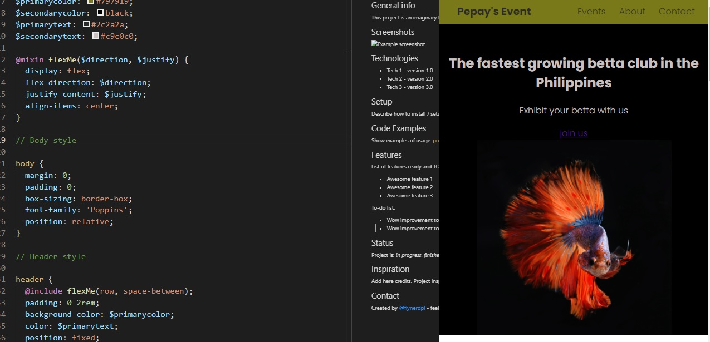

# Responsive_Club_Website

> This is a project in codecademy under Front-end development of the Full-Stack Engineer career path.

## Table of contents

- [General info](#general-info)
- [Screenshots](#screenshots)
- [Technologies](#technologies)
- [Features](#features)
- [Status](#status)
- [Inspiration](#inspiration)
- [Contact](#contact)

## General info

This project is an imaginary Event orginizing website specifically a betta fish event and exhiit.

## Screenshots

## Technologies

- HTML5
- CSS3
- Sass

## Features

- Responsive website
- Hover effects
- Button transform feature

To-do list:

- Complition of styles
- add medea query

## Status

Project is: _in progress_

## Inspiration

This is basedon the growing number of members of a betta club that I would like to give website proposal.

## Contact

Created by [@gideon](linkedin.com/in/gideon-flores-8b598417a) - feel free to contact me!
